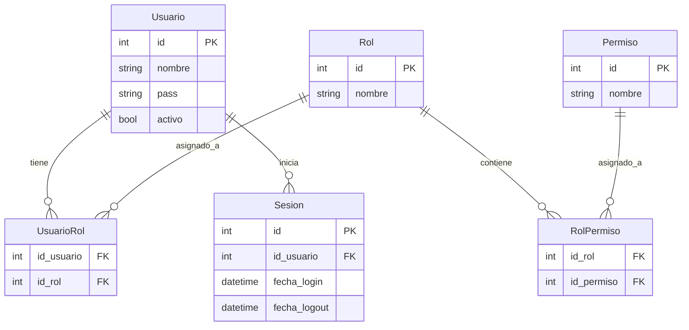
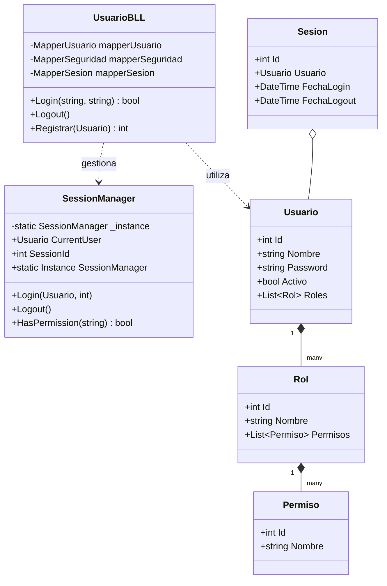

# Documentación de Implementación: Gestión de Usuarios, Login y RBAC (T02)

Este documento detalla la implementación técnica de la consigna **T02**, que abarca el sistema de autenticación (Login/Logout), gestión de sesiones y control de acceso basado en roles (RBAC). La solución sigue una arquitectura de 4 capas y cumple con la Tercera Forma Normal (3NF) en la base de datos.

## Estructura del Sistema

Se implementó una solución desacoplada utilizando los siguientes componentes:

### 1. Base de Datos (Persistencia)
Se creó un script de inicialización limpia ([schema-init.sql](../../docs/schema-init.sql)) que define la estructura 3NF eliminando conceptos obsoletos (como `Jugador`).
- **Tablas**: `Usuario`, `Rol`, `Permiso`, `UsuarioRol`, `RolPermiso` y `Sesion`.
- **Stored Procedures**: Toda la comunicación con la base de datos se realiza mediante procedimientos almacenados parametrizados para evitar inyecciones SQL.
- **Datos iniciales**: Se incluyó un rol `Admin` con permisos de gestión y un usuario `admin` (password: `admin123`) para el primer acceso.

### 2. Capa de Entidades de Negocio (BE)
Clases que representan el dominio del sistema y se comparten entre todas las capas:
- `Usuario`: Posee ID, Nombre, Password, estado Activo y una lista de `Roles`.
- `Rol`: Posee ID, Nombre y una lista de `Permisos`.
- `Permiso`: Representa una acción o acceso atómico en el sistema.
- `Sesion`: Rastrea el acceso de un usuario con fecha de inicio y fin.

### 3. Capa de Acceso a Datos (DAL)
Utiliza la clase base `Acceso.cs` para gestionar la conectividad ADO.NET. Se implementaron los siguientes Mappers:
- `MapperUsuario`: Búsqueda y creación de usuarios.
- `MapperSeguridad`: Hidratación de Roles y Permisos asociados a un usuario.
- `MapperSesion`: Gestión del ciclo de vida de la sesión en la base de datos.

### 4. Capa de Lógica de Negocio (BLL)
Contiene las reglas de negocio y la gestión de estado:
- **SessionManager (Singleton)**: Implementado bajo el patrón Singleton para garantizar un único contexto de seguridad global. Permite verificar permisos en cualquier parte del sistema mediante `SessionManager.Instance.HasPermission("NombrePermiso")`.
- **UsuarioBLL**: Gestiona el proceso de Login (validación, carga de perfil RBAC e inicio de sesión) y el Logout.

### 5. Capa de Interfaz de Usuario (GUI)
Interfaz desarrollada en Windows Forms siguiendo el estándar MDI (Multiple Document Interface):
- **FormLogin**: Pantalla de acceso inicial que valida credenciales.
- **FormMain (MDI Parent)**: Ventana contenedora principal. Utiliza el `SessionManager` para habilitar o deshabilitar menús de forma dinámica según los permisos del usuario logueado.
- **FormGestionUsuarios**: Formulario para que los administradores registren nuevos usuarios en el sistema.

## Seguridad y Patrones
- **Patrón Singleton**: Utilizado para el manejo de la sesión activa, asegurando integridad en las comprobaciones de seguridad.
- **RBAC**: El sistema permite una granularidad total, donde un usuario tiene roles y estos roles tienen permisos. La UI se adapta a este modelo.
- **Desacoplamiento**: La GUI nunca accede directamente a la DAL o BE sin pasar por la BLL, manteniendo la integridad de la arquitectura en N capas.

## Diagramas de Arquitectura

### 1. Diagrama de Entidad-Relación (DER)
Este diagrama representa la estructura de la base de datos en 3NF para el sistema de seguridad y usuarios.

### 2. Diagrama de Clases
Representación de la estructura de clases en las capas BE y BLL, destacando el uso del patrón Singleton.

